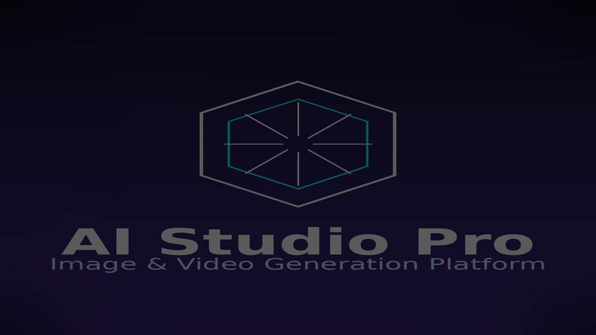
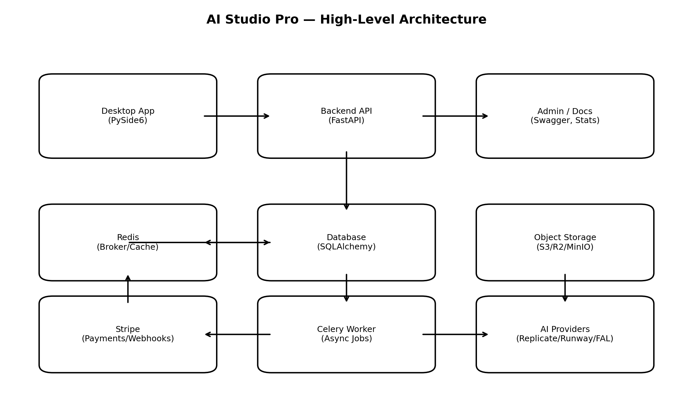
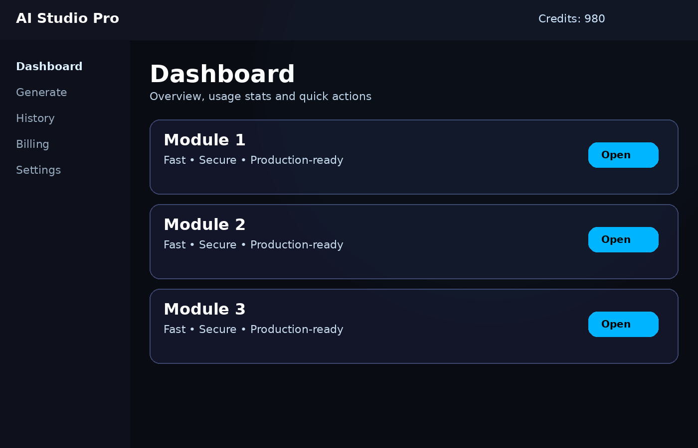
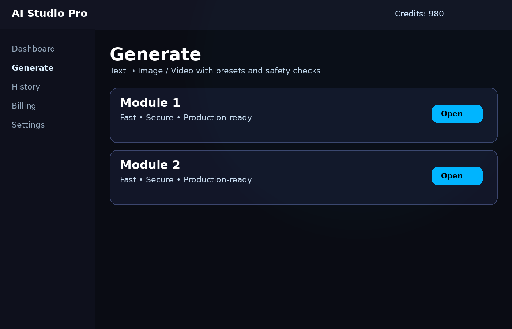
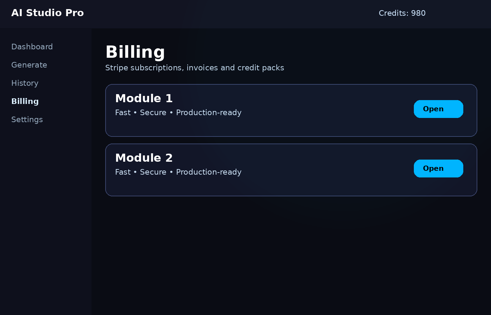
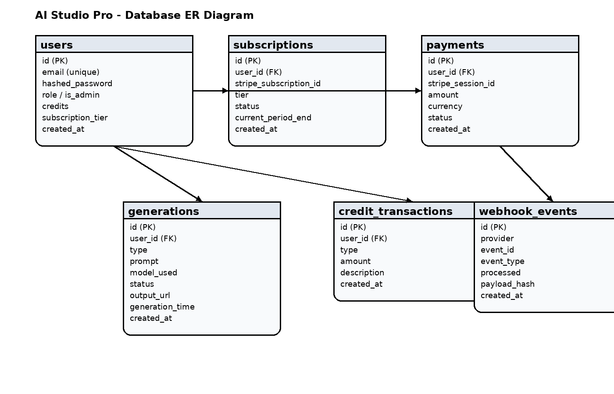

# AI Studio Pro

<p align="center">
  
</p>

## Application Professionnelle de Génération d'Images et Vidéos par Intelligence Artificielle


---

## 📋 Table des matières

- [Présentation](#présentation)
- [Architecture](#architecture)
- [Fonctionnalités](#fonctionnalités)
- [Installation](#installation)
- [Structure du projet](#structure-du-projet)
- [Technologies](#technologies)
- [Documentation](#documentation)
- [Auteur](#auteur)

---

## 🎯 Présentation

**AI Studio Pro** est une plateforme professionnelle permettant la génération d'images et de vidéos par intelligence artificielle. L'application est accessible via :

- ✅ **Application Desktop Windows** (PySide6/Qt)
- ✅ **Application Web** (React/Next.js)
- ✅ **API REST** (FastAPI)

Le système utilise des modèles AI cloud (Stable Diffusion, Runway) pour garantir des performances optimales sans nécessiter de matériel puissant côté client.

---

## 🏗️ Architecture

<p align="center">
  
</p>

## 🖥️ Aperçu (Screenshots)

<p align="center">
  
  <br/>
  
  <br/>
  
</p>

```
┌─────────────────────────────────────────────────────────────────┐
│                        AI Studio Pro                             │
├─────────────────────────────────────────────────────────────────┤
│                                                                  │
│  ┌──────────────┐      ┌──────────────┐      ┌──────────────┐  │
│  │   Desktop    │      │     Web      │      │  Mobile App  │  │
│  │  (PySide6)   │      │  (React)     │      │   (Future)   │  │
│  └──────┬───────┘      └──────┬───────┘      └──────────────┘  │
│         │                      │                                 │
│         └──────────┬───────────┘                                 │
│                    │                                             │
│         ┌──────────▼───────────┐                                 │
│         │   API Gateway        │                                 │
│         │   (FastAPI)          │                                 │
│         └──────────┬───────────┘                                 │
│                    │                                             │
│    ┌───────────────┼───────────────┐                            │
│    │               │               │                            │
│ ┌──▼───┐     ┌────▼────┐    ┌─────▼─────┐                      │
│ │Auth  │     │ Credits │    │Generation │                      │
│ │JWT   │     │ System  │    │  Service  │                      │
│ └──┬───┘     └────┬────┘    └─────┬─────┘                      │
│    │                                   │                         │
│    └──────────────┼───────────────────┘                         │
│                   │                                              │
│         ┌─────────▼──────────┐                                   │
│         │  PostgreSQL + S3   │                                   │
│         └────────────────────┘                                   │
│                                                                  │
│         ┌────────────────────┐                                   │
│         │  AI Services       │                                   │
│         │  (Replicate/Runway)│                                   │
│         └────────────────────┘                                   │
│                                                                  │
└─────────────────────────────────────────────────────────────────┘
```

---

## ✨ Fonctionnalités

### 🖼️ Génération d'Images
- Prompts textuels avec styles prédéfinis
- Résolutions multiples (512x512 à 1920x1080)
- Negative prompts pour un meilleur contrôle
- Historique complet des générations

### 🎬 Génération de Vidéos
- Transformation de texte en vidéo
- Durées configurables (2-16 secondes)
- Résolutions HD disponibles
- Export au format MP4

### 💎 Système de Crédits
- Crédits offerts à l'inscription (100 crédits)
- Achat de packs de crédits
- Abonnements mensuels avec crédits inclus
- Historique des transactions

### 💳 Paiements
- Intégration Stripe sécurisée
- Paiements par carte bancaire
- Gestion des abonnements
- Webhooks pour synchronisation

### 🔒 Sécurité
- Authentification JWT
- Clés API protégées côté serveur
- Rate limiting
- Validation des données

---

## 🚀 Installation

### Prérequis

- Python 3.11+
- Node.js 18+
- PostgreSQL 15+ (optionnel, SQLite par défaut)
- Compte Stripe (pour les paiements)
- Clé API Replicate (pour la génération AI)

### Installation automatique

**Windows :**
```bash
install.bat
```

**Linux/Mac :**
```bash
chmod +x install.sh
./install.sh
```

### Installation manuelle

#### 1. Backend

```bash
cd backend

# Créer l'environnement virtuel
python -m venv venv
venv\Scripts\activate  # Windows
source venv/bin/activate  # Linux/Mac

# Installer les dépendances
pip install -r requirements.txt

# Configuration
cp .env.example .env
# Éditer .env avec vos clés API

# Lancer le serveur
uvicorn main:app --reload
```

#### 2. Application Desktop

```bash
cd desktop

python -m venv venv
venv\Scripts\activate  # Windows

pip install -r requirements.txt

# Lancer l'application
python main.py
```

#### 3. Application Web

```bash
cd webapp

npm install

# Configuration
cp .env.example .env.local
# Éditer .env.local

# Lancer le serveur de développement
npm run dev
```

### Build Exécutable Windows

```bash
cd desktop
pyinstaller build.spec
```

L'exécutable sera créé dans `dist/AI Studio Pro.exe`

---

## 📁 Structure du projet

```
ai_studio_pro/
├── 📁 backend/                    # Backend FastAPI
│   ├── app/
│   │   ├── core/                 # Configuration, sécurité
│   │   ├── models/               # Modèles SQLAlchemy
│   │   ├── schemas/              # Modèles Pydantic
│   │   ├── services/             # Logique métier
│   │   └── api/v1/endpoints/     # Routes API
│   ├── main.py
│   ├── requirements.txt
│   ├── Dockerfile
│   └── docker-compose.yml
│
├── 📁 desktop/                    # Application Desktop PySide6
│   ├── src/
│   │   ├── core/                 # Configuration, thèmes
│   │   ├── api/                  # Client HTTP
│   │   └── ui/                   # Interface utilisateur
│   ├── main.py
│   ├── build.spec
│   └── requirements.txt
│
├── 📁 webapp/                     # Application Web React/Next.js
│   ├── src/
│   │   ├── app/                  # Routes Next.js
│   │   ├── components/           # Composants React
│   │   ├── hooks/                # Hooks personnalisés
│   │   ├── lib/                  # Utilitaires
│   │   ├── store/                # État global (Zustand)
│   │   └── types/                # Types TypeScript
│   ├── package.json
│   └── next.config.js
│
├── 📁 rapport_pfe/               # Rapport PFE
│   └── Rapport_PFE_AI_Studio_Pro.docx
│
├── README.md
├── install.bat / install.sh
└── LICENSE
```

---

## 🛠️ Technologies

### Backend
- **FastAPI** - Framework web Python haute performance
- **SQLAlchemy** - ORM pour bases de données
- **PostgreSQL** - Base de données relationnelle
- **JWT** - Authentification par tokens
- **Stripe** - Paiements en ligne
- **Replicate API** - Génération d'images/vidéos AI

### Desktop
- **PySide6** - Framework Qt pour Python
- **httpx** - Client HTTP asynchrone
- **QSS** - Feuilles de style Qt

### Web
- **Next.js 14** - Framework React
- **TypeScript** - Typage statique
- **Tailwind CSS** - Framework CSS utilitaire
- **Radix UI** - Composants UI headless
- **Zustand** - Gestion d'état
- **TanStack Query** - Gestion des requêtes API

---

## 📚 Documentation

- [Rapport PFE](rapport_pfe/Rapport_PFE_AI_Studio_Pro.docx) - Document complet du projet
- [Documentation Backend](backend/README.md)
- [Documentation Desktop](desktop/README.md)
- [Documentation Web](webapp/README.md)

---

## 👤 Auteur

**Projet de Fin d'Études**

- Étudiant : [Nom de l'étudiant]
- Encadrant : [Nom de l'encadrant]
- Université : [Nom de l'université]
- Année universitaire : 2024-2025

---

## 📄 Licence

Ce projet est sous licence MIT. Voir le fichier [LICENSE](LICENSE) pour plus de détails.

---

## 🙏 Remerciements

- Replicate pour l'API de génération AI
- Stripe pour les services de paiement
- La communauté open source pour les outils utilisés

---

<p align="center">
  <strong>AI Studio Pro</strong> - Libérez votre créativité avec l'IA
</p>


## Database



## Tests (Backend)

```bash
cd backend
pip install -r requirements.txt
pytest -q
```

## Documentation

- `docs/API_REFERENCE.md`
- `docs/DB_SCHEMA.md`
- `docs/PROD_CHECKLIST.md`
